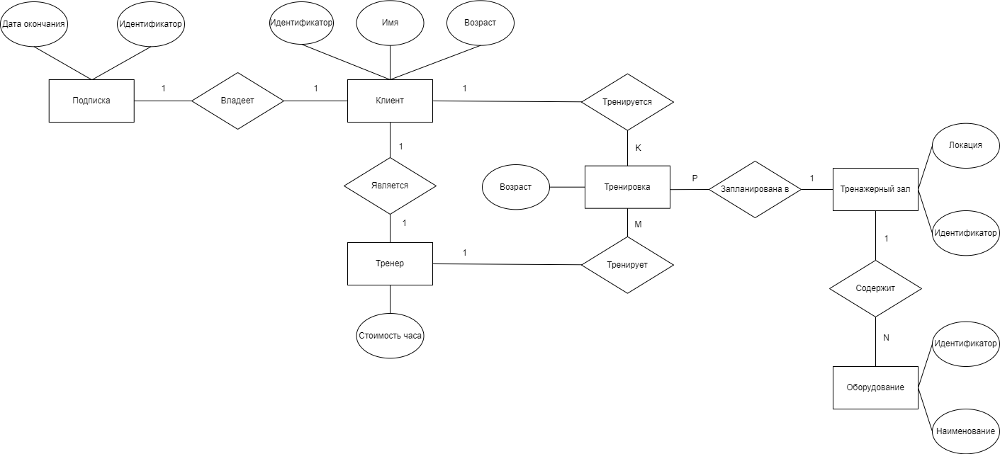

# Лабораторная работа №1. Начало работы с СУБД.

## ER-диаграмма.

## Выполнение работы

В директории `/script`:
1. `/generator` - создает в `/query` SQL инструкции INSERT c заданным кол-вом данных. Регулируется количество клиентов, тренировок и оборудывания. Управление с помощью флагов.

2. `/migrator` - подключается к БД и выполняет SQL инструкцию из файла, переданного через флаг.